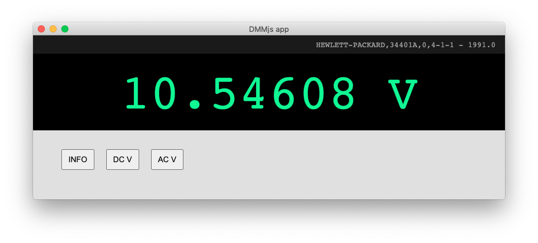
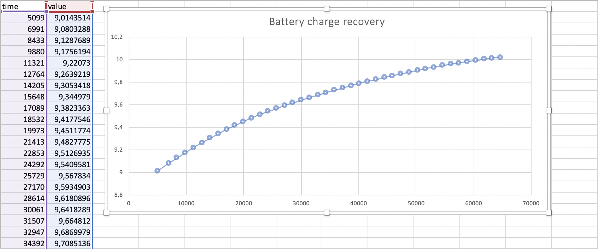

# Virtual DMM electron interface

Electron application for the Agilent 34401A (work in progress)

Based on the [DMM.js-serial](https://github.com/rascafr/dmm-js) library



## Run it

```bash
git clone https://github.com/rascafr/dmm-js-app.git
cd dmm-js-app
npm i
npm start
```

## Data logging

Even if it's not the main application's purpose, you can log values into a CSV file (the data will be saved with semicolon delimiters). Both raw value and time (in ms) will be saved, so you can perform some *Δv / Δt* calculations with the resulting data.



Just indicate the CSV output file path when calling the application from the command line:

```bash
npm start ~/Desktop/logMyData.csv
```

- wait for the device to be connected
- select the function you want to use for the measurement (e.g.: **DC V**)
- press the **Auto** button after the first measurement to start the recording, screen will refresh for each measurement
- take a coffee ☕, wait for as long as you need
- select the **Single** button to stop the recording
- close the window to disconnect the device and save data to the output file

## Troubleshooting

https://github.com/serialport/node-serialport/issues/1910#issuecomment-524949720