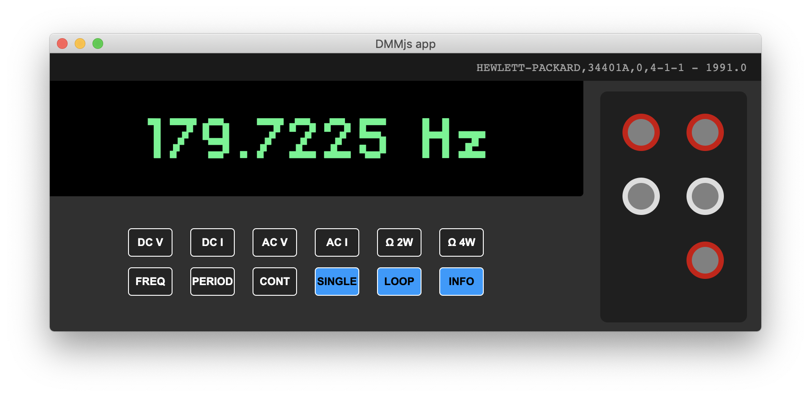

# Virtual DMM electron interface

MVP Electron application for the Agilent 34401A.

Based on the [DMM.js-serial](https://github.com/rascafr/dmm-js) library.

Should work without any issue for other RS232 SCPI-compatible measurement tool (HP / Agilent 34410, Keithley 2000...)



## Features

- AC / DC current & voltage
- 2 and 4 wire (kelvin) resistance measurement
- Frequency and period
- Single / Loop reading mode
- CSV time / value data logging 
- Auto-connect, display connected device info

## Next release

Kinda lazy, needs to be done

- Better design
- True toggle buttons
- Front / Read measure indication
- Better device lifecycle management & command transaction queue
- Errors display feature
- Device configuration menu
- Data-logging dedicated menu

## Installation

```bash
git clone https://github.com/rascafr/dmm-js-app.git
cd dmm-js-app

# rebuild serialport dependency for electron
npm i -D electron-rebuild
npm i
./node_modules/.bin/electron-rebuild
```

## Run it

```bash
npm start
```

## Data logging

Even if it's not the main application's purpose, you can log values into a CSV file (the data will be saved with semicolon delimiters). Both raw value and time (in ms) will be saved, so you can perform some *Δv / Δt* calculations with the resulting data.


Just indicate the CSV output file path when calling the application from the command line:

```bash
npm start ~/Desktop/logMyData.csv
```

### Recording steps

- wait for the device to be connected
- select the function you want to use for the measurement (e.g.: **DC V**)
- press the **Loop** button after the first measurement to start the recording, screen will refresh after each reading
- take a coffee ☕, wait for as long as you need
- select the **Single** button to stop the recording
- close the window to disconnect the device and save data to the output file

## Troubleshooting

Installation instruction are up-to-date with the following tips about the serialport library (used in [DMM.js-serial](https://github.com/rascafr/dmm-js)).

https://github.com/serialport/node-serialport/issues/1910#issuecomment-524949720